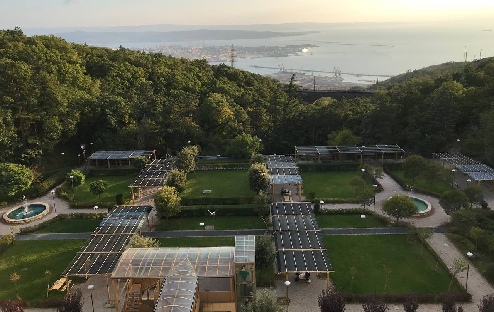

<!-- DEFINE THE STYLE OF THE WEBSITE MENU  -->

<head>
    <meta charset="UTF-8">
    <meta name="viewport" content="width=device-width, initial-scale=1.0">
    <title>Menu Example</title>
    
</head>
<body>

    <nav>
        <ul>
            <li><a href="https://aleetamai.github.io">Home</a></li>
            <li><a href="https://aleetamai.github.io/talks&carrer">Talks&Career</a></li>
            <li><a href="https://aleetamai.github.io/works">Works</a></li>
        </ul>
    </nav>

</body>

<!-- DEFINE THE SIDEBAR FOR THE PRESENTATION  -->

<head>
<meta name="viewport" content="width=device-width, initial-scale=1">

</head>

<!------------------------------------------------------------------------------------------------  -->
<!--------------------------------------- Bulding Website ----------------------------------------  -->
<!------------------------------------------------------------------------------------------------  -->

<!-- TITLE AND PRESENTATION  -->

<h1>Alessandro Tamai</h1>

 

-------

​_Ph.D. student <a style="color:black;" href="https://math.sissa.it/users/alessandro-tamai"><b>at SISSA </b></a> in Geometry and Mathematical Physics as member of the <a style="color:black;" href="https://sites.google.com/view/realalgebraicgeometry/home"><b>Real Geometry Group</b></a>, under the supervision of <a style="color:black;" href="https://sites.google.com/view/lerario/home"><b>Antonio Lerario</b></a>._

<!-- CONTACTS AND INTERESTS  -->

<body>

  

    <h2>Contacts</h2>
      
email:  atamai@sissa.it
       
      office: room 416

  

  

    <h2 style="color:black;">Research Interests:</h2>
     
 My main interests are on applications of metric geometry, real algebraic geometry and Morse Theory in machine learning. Other interests cover differential topology, Riemannian and subRiemannian geometry and Lie groups.

  

  

  

    <h2 style="color:black;">Where I am (right now):</h2>
     
 SISSA is a beautiful research center in Trieste (Italy), surrounded by mountains and sea, wrapped in the wind.  

  

  
  
<figcaption>Questa è la mia immagine con una didascalia</figcaption>

