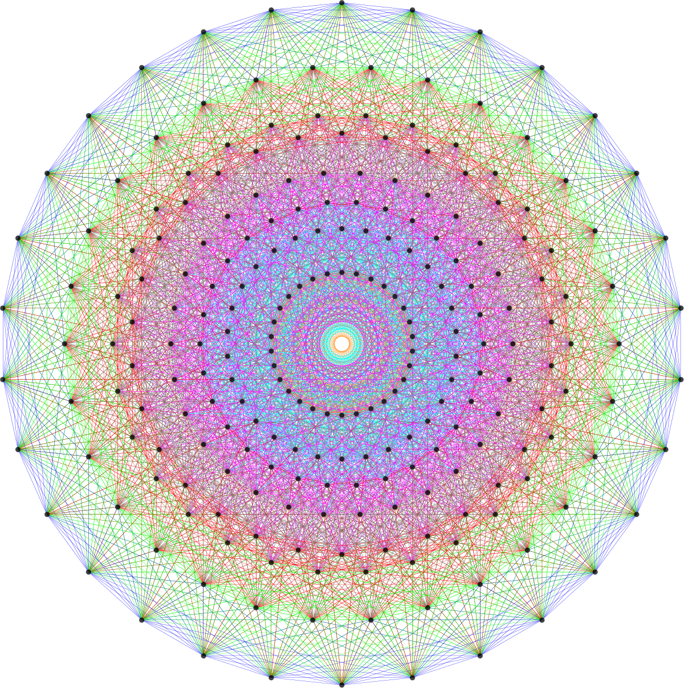

<!-- Here we duind the menu-->

  

  <a href="https://aleetamai.github.io">Home</a>
  <a href="https://aleetamai.github.io/talks&carrer">Talks & Career</a>
  <a href="https://www.sissa.it">SISSA</a>

  

 

---------

​_Ph.D. student at [SISSA](https://www.sissa.it) in Geometry and Mathematical Physics, under the supervision of Antonio Lerario._

 

>_The cardinal notions of number, place, and combination...three intersecting but distinct spheres of thought to which all mathematical ideas admit of being referred._
> 
>**James Joseph Sylvester**

 
 
 

## Research Interests:
My main research interest are on metric geometry, Morse theory and optimal transport for data analysis and machine learning.   
                                                                                                                               
Other interests cover differential topology, Riemannian and subRiemannian geometry, real algebraic geometry and Lie groups.

## Contacts:

email:  atamai@sissa.it
 
office: room 416, SISSA, Via Bonomea, 265, 34136, Trieste (TS)
