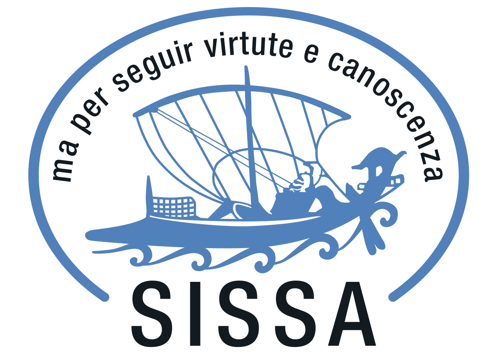
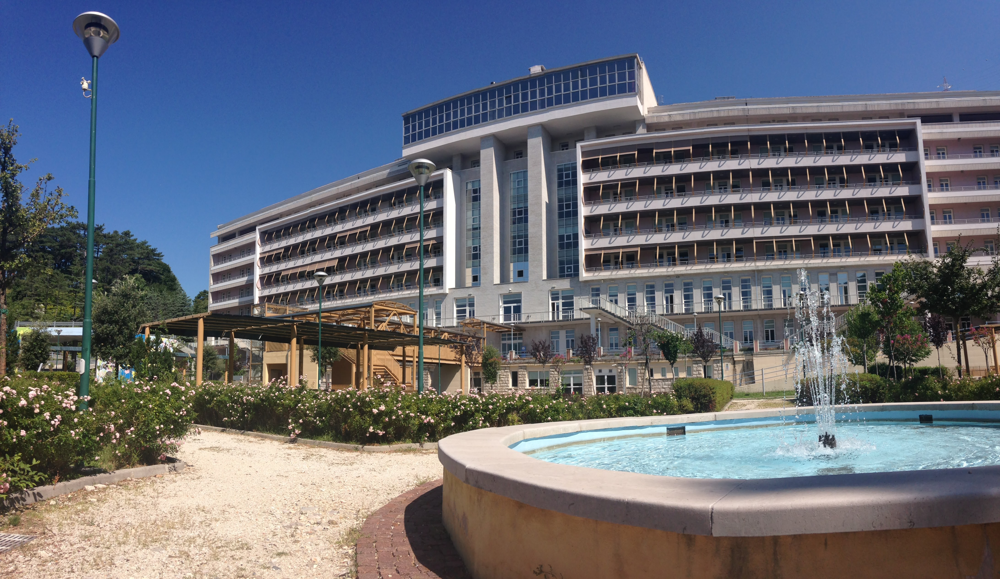

<!-- DEFINING SMALL SIDEBAR  -->

<head>
<meta charset="UTF-8">
<meta name="viewport" content="width=device-width, initial-scale=1.0">
<title>Side Bar Example</title>

</head>

<!-- DEFINE THE STYLE OF THE WEBSITE MENU  -->

<html lang="en">
<head>
<meta charset="UTF-8">
<meta name="viewport" content="width=device-width, initial-scale=1.0">
<title>Navigation Menu Example</title>

</head>
<body>

    

        <a href="https://aleetamai.github.io">Home</a>
        <a href="https://aleetamai.github.io/talks&carrer">Talks & Career</a>
        <a href="https://aleetamai.github.io/works">Works</a>
    

</body>
</html>

<!-- TITLE AND PRESENTATION  -->

<h1>Alessandro Tamai</h1>

 

-------

​_Ph.D. student <a style="color:black;" href="https://math.sissa.it/users/alessandro-tamai"><b>at SISSA </b></a> in Geometry and Mathematical Physics, under the supervision of Antonio Lerario._

 
 
 
 
 

<!-- CONTACTS AND INTERESTS  -->

    <!-- Sidebar -->
    

    <h2>Contacts</h2>
      
email:  atamai@sissa.it
       
      office: room 416

    

    <!-- Page Content -->
    

    <h2 style="color:white;">Research Interests:</h2>
     
 My main interests are on applicatioons of metric geometry, real algebraic geometry and Morse theory in machine learning. Other interests cover differential topology, Riemannian and subRiemannian geometry and Lie groups.

    

<!-- SISSA PHOTOS  -->

 

<h2>Sissa Buildings</h2>
Via Bonomea, 265, 34136 Trieste (Italy)

