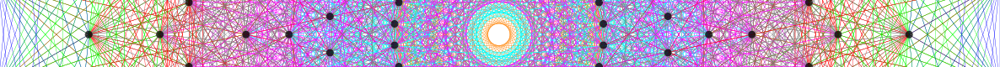
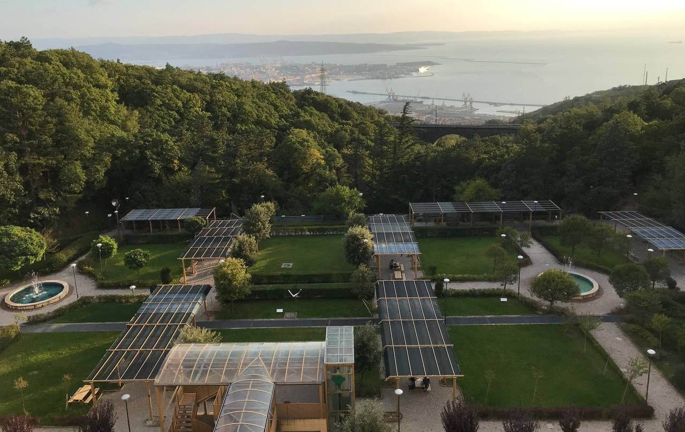

<!-- DEFINE THE STYLE OF THE WEBSITE MENU  -->

<head>
    <meta charset="UTF-8">
    <meta name="viewport" content="width=device-width, initial-scale=1.0">
    <title>Menu Example</title>
    
</head>
<body>

    <nav>
        <ul>
            <li><a href="https://aleetamai.github.io">Home</a></li>
            <li><a href="https://aleetamai.github.io/talks&carrer">Talks&Career</a></li>
            <li><a href="https://aleetamai.github.io/works">Works</a></li>
        </ul>
    </nav>

</body>

<!-- MAIN  -->

# Career 

## Career
- Postgraduate Fellowship in Geometry and Mathematical Physics, _SISSA, Trieste (Italy), April 2021 - July 2021_
- Master's degree in Mathematics, title  "Singular Solutions of Rolling Balls Model: a Topological View", _University of Trieste, Trieste (Italy), 2017-2020_
- Bachelor's degree in Mathematics, title "Introduzione alla Teoria delle Perturbazioni di Sistemi Hamiltoniani Autonomi" _University of Trieste, Trieste, Italy, 2014-2017_
- Erasmus program at "UCL: Univ. Catholique de Louvain-La-Neuve", _Louvain-la-Neuve, Belgium, Sept. 2017- Feb. 2017_
- Diploma of Perito Chimico, _Istituto Superiore Statale "Giorgi-Fermi", Treviso (Italy), 2009-2014_

## Conferences and Seminars 

- _"New challenges across Analysis and Geometry"_ conference at SISSA, Trieste  (Speaker);
- _"Metric Algebraic Geometry"_ conference at KTH, Stockholm (Sweden), November 2024 (Speaker);
- Visitor at KTH, Stockholm (Sweden), November/December 2024 (Attended);
- _"Metric Measure Spaces, Ricci Curvature, and Optimal Transport"_ conference in Varenna (Italy), September 2024 (Attended);
- Visitor at KTH,  Stockholm (Sweden), on November/December 2023 (Attended);
- _"High Dimensional Statistics and Random Matrices"_ conference in Porquerolles (France), on June 2023 (Attended);
- _"Youth in High-Dimensions: Recent Progress in Machine Learning, High-Dimensional Statistics and Inference"_ conference at ICTP, Trieste (Italy), on May 2023  (Attended);
- _"Quantinuum Quantum Hackathon"_ at  ICTP, Trieste  (Italy), on April 2023 (Attended);
- _"From Statistical Physics to Random Geometry"_  conference at SISSA, Trieste (Italy), on September 2022  (Attended);
- _"Random Matrices, Random Graphs and Statistical Physics for Machine Learning and Inference"_ at ICTP Trieste (Italy), on May 2022 (Attended);

## Past Work Experiences
- Exerciser of Geometria 1 (Linear Algebra), _Università degli Studi di Trieste, October 2019- January 2020, Trieste (Italia)_
- Exerciser of Geometria 3B (Topology), _Universita' degli Studi di Trieste, March 2019- June 2019, Trieste (Italia)_
- Exerciser of Analisi 1 (Calculus), _Università degli Studi di Trieste, October 2018- January 2019 Trieste (Italia)_

 

